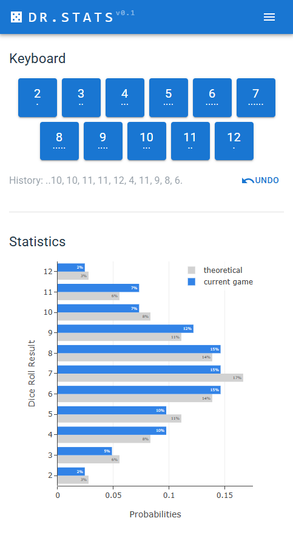

# Dice Roll Statistics

This app lets users record a sequence of dice rolls and view live statistics. It displays the probability of the observed sequence alongside the theoretical probabilities that would normally be expected.

_Note: This idea came after a Catan board game._

**Try Here: [https://dice.42borgata.com/]()**

## Preview

## Build / Development

- run `npm i` to install.
- run `npm run dev` to start a dev server (follow instructions to browse the app)
- run `npm run buil` to build a production version.